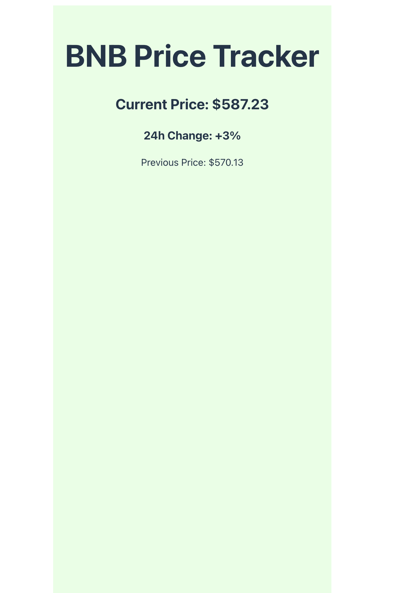
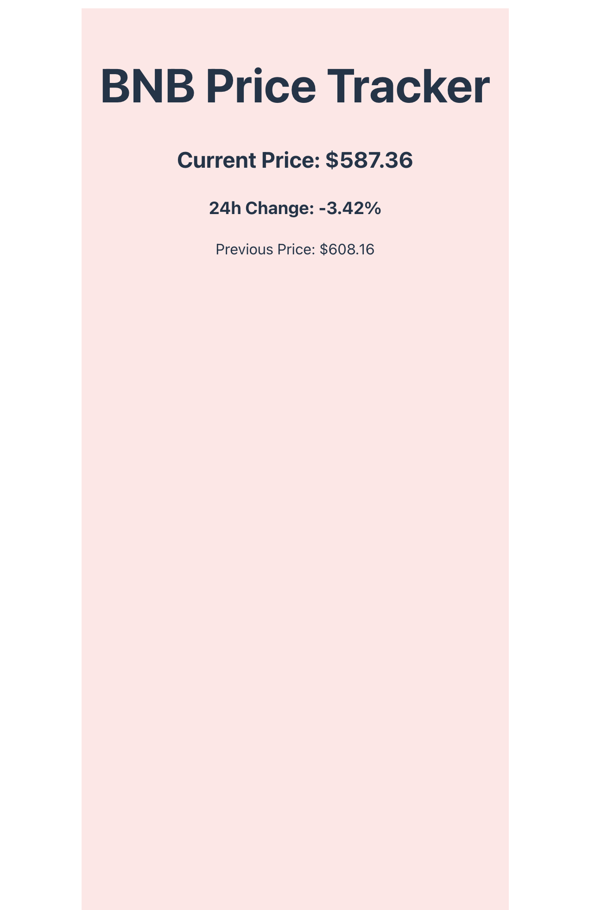

# BNB Price Tracker

A React application that tracks BNB price with real-time visual feedback.

## Demo




## Quick Start

1. Add your CoinGecko API key to `.env`:
```
VITE_COIN_GECKO_API_KEY=your_api_key_here
```

2. Install & run:
```bash
# or
npm run dev
# or
yarn dev
```

## Features

- Real-time BNB price tracking using CoinGecko API
- 24-hour price change percentage (mocked for demonstration)
- Visual feedback:
  - Green background when price increases
  - Red background when price decreases
  - Color-coded price change indicators
- Automatic price updates every minute

## Screenshots

### Price Increase


### Price Decrease


## Getting Started

### Installation

1. Clone the repository:
```bash
git clone <repository-url>
cd coin-gecko-api-playground
```

2. Install dependencies:
```bash
npm install
# or
yarn install
```

3. Create a `.env` file in the root directory and add your CoinGecko API key:
```
VITE_COIN_GECKO_API_KEY=your_api_key_here
```

4. Start the development server:
```bash
npm run dev
# or
yarn dev
# or
deno task dev
```

## Environment Variables

- `VITE_COIN_GECKO_API_KEY`: Your CoinGecko API key